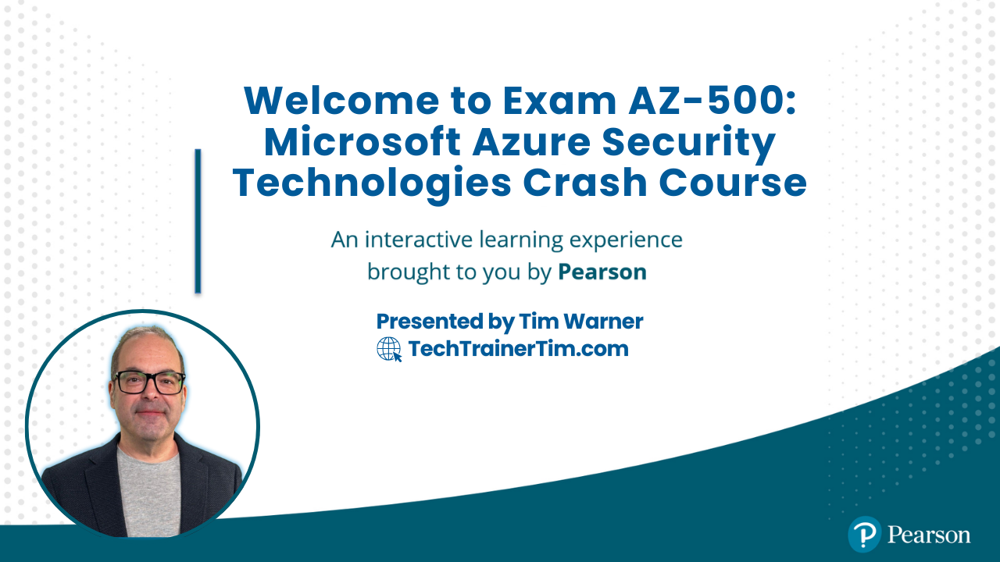

# Exam AZ-500: Microsoft Azure Security Technologies Crash Course

Welcome to the training hub for preparing for the **AZ-500 Microsoft Azure Security Technologies Exam**. Whether you're aiming for certification or deepening your Azure security knowledge, this guide is packed with the best tools, links, and tips to set you up for success.

*Last updated: March 18, 2025*

---

## 📬 **Contact Information**
- **[Website](https://techtrainertim.com)**
- **[GitHub](https://github.com/timothywarner)**
- **[LinkedIn](https://www.linkedin.com/in/timothywarner/)**
- **[YouTube Channel](https://www.youtube.com/channel/UCim7PFtynyPuzMHtbNyYOXA)**
- **[Bluesky](https://bsky.app/profile/techtrainertim.bsky.social)**
- **[Mastodon](https://mastodon.social/@techtrainertim)**

---

## 📋 **Exam Objective Domain**
*Skills measured as of January 31, 2025*

### Skills at a Glance
- **Secure identity and access** (15–20%)
- **Secure networking** (20–25%)
- **Secure compute, storage, and databases** (20–25%)
- **Secure Azure using Microsoft Defender for Cloud and Microsoft Sentinel** (30–35%)

### Audience Profile
As an Azure security engineer, you implement, manage, and monitor security for resources in Azure, multi-cloud, and hybrid environments as part of an end-to-end infrastructure. You implement and manage security components and configurations using Microsoft Defender for Cloud and other tools, ensuring infrastructure aligns with standards and best practices such as the Microsoft Cloud Security Benchmark (MCSB).

#### Your responsibilities include:
- Managing security posture
- Implementing threat protection
- Identifying and remediating vulnerabilities
- Implementing regulatory compliance controls

#### Required experience:
- Practical experience in administration of Microsoft Azure and hybrid environments
- Strong familiarity with Microsoft Entra ID, as well as compute, network, and storage in Azure

### Detailed Skill Outline

#### 1. Secure Identity and Access (15–20%)

##### 1.1 Manage security controls for identity and access
- Manage Azure built-in role assignments
- Manage custom roles, including Azure roles and Microsoft Entra roles
- Implement and manage Microsoft Entra Permissions Management
- Plan and manage Azure resources in Microsoft Entra Privileged Identity Management, including settings and assignments
- Implement multi-factor authentication (MFA) for access to Azure resources
- Implement Conditional Access policies for cloud resources in Azure

##### 1.2 Manage Microsoft Entra application access
- Manage access to enterprise applications in Microsoft Entra ID, including OAuth permission grants
- Manage Microsoft Entra app registrations
- Configure app registration permission scopes
- Manage app registration permission consent
- Manage and use service principals
- Manage managed identities

#### 2. Secure Networking (20–25%)

##### 2.1 Plan and implement security for virtual networks
- Plan and implement Network Security Groups (NSGs) and Application Security Groups (ASGs)
- Manage virtual networks by using Azure Virtual Network Manager
- Plan and implement user-defined routes (UDRs)
- Plan and implement Virtual Network peering or VPN gateway
- Plan and implement Virtual WAN, including secured virtual hub
- Secure VPN connectivity, including point-to-site and site-to-site
- Implement encryption over ExpressRoute
- Configure firewall settings on Azure resources
- Monitor network security by using Network Watcher

##### 2.2 Plan and implement security for private access to Azure resources
- Plan and implement virtual network Service Endpoints
- Plan and implement Private Endpoints
- Plan and implement Private Link services
- Plan and implement network integration for Azure App Service and Azure Functions
- Plan and implement network security configurations for an App Service Environment (ASE)
- Plan and implement network security configurations for an Azure SQL Managed Instance

##### 2.3 Plan and implement security for public access to Azure resources
- Plan and implement Transport Layer Security (TLS) to applications, including Azure App Service and API Management
- Plan, implement, and manage an Azure Firewall, including Azure Firewall Manager and firewall policies
- Plan and implement an Azure Application Gateway
- Plan and implement an Azure Front Door, including Content Delivery Network (CDN)
- Plan and implement a Web Application Firewall (WAF)
- Recommend when to use Azure DDoS Protection Standard

#### 3. Secure Compute, Storage, and Databases (20–25%)

##### 3.1 Plan and implement advanced security for compute
- Plan and implement remote access to virtual machines, including Azure Bastion and just-in-time (JIT)
- Configure network isolation for Azure Kubernetes Service (AKS)
- Secure and monitor AKS
- Configure authentication for AKS
- Configure security monitoring for Azure Container Instances (ACIs)
- Configure security monitoring for Azure Container Apps (ACAs)
- Manage access to Azure Container Registry (ACR)
- Configure disk encryption, including Azure Disk Encryption (ADE), encryption at host, and confidential disk encryption
- Recommend security configurations for Azure API Management

##### 3.2 Plan and implement security for storage
- Configure access control for storage accounts
- Manage storage account access keys
- Select and configure an appropriate method for access to Azure Files
- Select and configure an appropriate method for access to Azure Blob Storage
- Select and configure appropriate methods for protecting against data security threats, including soft delete, backups, versioning, and immutable storage
- Configure Bring your own key (BYOK)
- Enable double encryption at the Azure Storage infrastructure level

##### 3.3 Plan and implement security for Azure SQL Database and Azure SQL Managed Instance
- Enable Microsoft Entra database authentication
- Enable database auditing
- Plan and implement dynamic masking
- Implement Transparent Data Encryption (TDE)
- Recommend when to use Azure SQL Database Always Encrypted

#### 4. Secure Azure using Microsoft Defender for Cloud and Microsoft Sentinel (30–35%)

##### 4.1 Implement and manage enforcement of cloud governance policies
- Create, assign, and interpret policies and initiatives in Azure Policy
- Configure Azure Key Vault network settings
- Configure access to Key Vault, including vault access policies and Azure Role Based Access Control
- Manage certificates, secrets, and keys
- Configure key rotation
- Perform backup and recovery of certificates, secrets, and keys
- Implement security controls to protect backups
- Implement security controls for asset management

##### 4.2 Manage security posture by using Microsoft Defender for Cloud
- Identify and remediate security risks by using the Microsoft Defender for Cloud Secure Score and Inventory
- Assess compliance against security frameworks by using Microsoft Defender for Cloud
- Manage compliance standards in Microsoft Defender for Cloud
- Add custom standards to Microsoft Defender for Cloud
- Connect hybrid cloud and multi-cloud environments to Microsoft Defender for Cloud, including Amazon Web Services (AWS) and Google Cloud Platform (GCP)
- Implement and use Microsoft Defender External Attack Surface Management (EASM)

##### 4.3 Configure and manage threat protection by using Microsoft Defender for Cloud
- Enable workload protection services in Microsoft Defender for Cloud
- Configure Microsoft Defender for Servers, Microsoft Defender for Databases, and Microsoft Defender for Storage
- Implement and manage agentless scanning for virtual machines in Microsoft Defender for Servers
- Implement and manage Microsoft Defender Vulnerability Management for Azure virtual machines
- Connect to and configure settings in Microsoft Defender for Cloud Devops Security, including GitHub, Azure DevOps, and GitLab

##### 4.4 Configure and manage security monitoring and automation solutions
- Manage and respond to security alerts in Microsoft Defender for Cloud
- Configure workflow automation by using Microsoft Defender for Cloud
- Monitor network security events and performance data by configuring data collection rules (DCRs) in Azure Monitor
- Configure data connectors in Microsoft Sentinel
- Enable analytics rules in Microsoft Sentinel
- Configure automation in Microsoft Sentinel

---

## 🚀 **The Good Stuff: Must-Have AZ-500 Resources**
- [AZ-500 Exam Page](https://learn.microsoft.com/en-us/certifications/exams/az-500)
- [AZ-500 Study Guide (2024)](https://learn.microsoft.com/en-us/credentials/certifications/resources/study-guides/az-500)
- [Exam Registration (Microsoft/Pearson VUE)](https://learn.microsoft.com/en-us/credentials/certifications/schedule-through-pearson-vue?examUid=exam.AZ-500)
- [AZ-500 Free Practice Assessment](https://learn.microsoft.com/en-us/credentials/certifications/azure-security-engineer/practice/assessment?assessment-type=practice)
- [Microsoft Learning AZ-500 Labs](https://microsoftlearning.github.io/AZ500-AzureSecurityTechnologies/)
- [Official Microsoft Learning Path](https://learn.microsoft.com/en-us/training/courses/az-500t00)
- [MeasureUp AZ-500 Practice Exams](https://www.measureup.com/az-500-microsoft-azure-security-technologies.html)

---

## 📚 **Microsoft Learn Paths**
Structured learning paths to master all exam skills:
- [Manage identity and access](https://learn.microsoft.com/en-us/training/paths/manage-identity-access/)
- [Implement platform protection](https://learn.microsoft.com/en-us/training/paths/implement-platform-protection/)
- [Manage security operations](https://learn.microsoft.com/en-us/training/paths/manage-security-operations/)
- [Secure Azure services and workloads](https://learn.microsoft.com/en-us/training/paths/secure-azure-services-workloads/)
- [Configure security for hybrid environments](https://learn.microsoft.com/en-us/training/paths/configure-security-for-hybrid-environments/)
- [Microsoft Defender for Cloud Implementation](https://learn.microsoft.com/en-us/training/paths/implement-microsoft-defender-for-cloud/)

---

## 🛡️ **Security Best Practices**
Expert guidance for implementing robust Azure security:

### Identity & Access Management
- [Microsoft Entra ID documentation](https://learn.microsoft.com/en-us/entra/identity/)
- [Azure RBAC documentation](https://learn.microsoft.com/en-us/azure/role-based-access-control/)
- [Privileged Identity Management](https://learn.microsoft.com/en-us/entra/id-governance/privileged-identity-management/)

### Data Protection
- [Microsoft Purview documentation](https://learn.microsoft.com/en-us/purview/)
- [Azure Key Vault documentation](https://learn.microsoft.com/en-us/azure/key-vault/)
- [Azure Storage Security](https://learn.microsoft.com/en-us/azure/storage/common/storage-security-guide)

### Network Security
- [Azure DDoS Protection](https://learn.microsoft.com/en-us/azure/ddos-protection/)
- [Azure Network Security](https://learn.microsoft.com/en-us/azure/security/fundamentals/network-overview)
- [Azure Firewall documentation](https://learn.microsoft.com/en-us/azure/firewall/)

---

## 🔧 **Your Toolkit**
Essential tools to follow along and practice efficiently:

### VS Code Extensions
- [Security IntelliSense](https://marketplace.visualstudio.com/items?itemName=azsdktm.SecurityIntelliSense)
- [Snyk Security](https://marketplace.visualstudio.com/items?itemName=snyk-security.snyk-vulnerability-scanner)
- [Azure Account](https://marketplace.visualstudio.com/items?itemName=ms-vscode.azure-account)

### PowerShell Modules
- [Az.Security](https://www.powershellgallery.com/packages/Az.Security)
- [Az.SecurityInsights](https://www.powershellgallery.com/packages/Az.SecurityInsights)
- [Az.KeyVault](https://www.powershellgallery.com/packages/Az.KeyVault)
- [Microsoft.PowerShell.SecretManagement](https://www.powershellgallery.com/packages/Microsoft.PowerShell.SecretManagement)

### Dev Tools
- [PowerShell 7](https://learn.microsoft.com/en-us/powershell/scripting/install/installing-powershell)
- [Azure CLI](https://learn.microsoft.com/en-us/cli/azure/install-azure-cli)
- [GitHub CLI](https://cli.github.com/)
- [Azure PowerShell Module](https://learn.microsoft.com/en-us/powershell/azure/install-az-ps)

---

## 💻 **Hands-on Labs & Practice**
Learn through hands-on experience:
- [Microsoft Security Assessment](https://www.microsoft.com/en-us/security/business/security-assessment)
- [Azure Security Center Workflow Automation](https://learn.microsoft.com/en-us/azure/defender-for-cloud/workflow-automation)
- [Microsoft Secure Score](https://security.microsoft.com/securescore)
- [Attack Surface Reduction Rules](https://learn.microsoft.com/en-us/microsoft-365/security/defender-endpoint/attack-surface-reduction)
- [Azure Free Account](https://azure.microsoft.com/en-us/free/)
- [Microsoft Learn Sandbox Environments](https://learn.microsoft.com/en-us/training/modules/describe-azure-compute-networking-services/4-exercise-configure-network-access)

---

## ✍️ **Practice Tests & Exam Prep**
Validate your knowledge before the real exam:
- [Microsoft Free Practice Assessment](https://learn.microsoft.com/en-us/credentials/certifications/azure-security-engineer/practice/assessment?assessment-type=practice)
- [MeasureUp AZ-500](https://www.measureup.com/az-500-microsoft-azure-security-technologies.html)
- [Udemy Practice Tests](https://www.udemy.com/topic/microsoft-az-500/)

---

## 🎓 **Related Certifications**
Expand your Microsoft security credentials:

### Microsoft Security Certifications
- [SC-100: Microsoft Cybersecurity Architect](https://learn.microsoft.com/en-us/credentials/certifications/cybersecurity-architect-expert/)
- [SC-200: Microsoft Security Operations Analyst](https://learn.microsoft.com/en-us/credentials/certifications/security-operations-analyst/)
- [SC-300: Microsoft Identity and Access Administrator](https://learn.microsoft.com/en-us/credentials/certifications/identity-and-access-administrator/)
- [SC-400: Microsoft Information Protection Administrator](https://learn.microsoft.com/en-us/credentials/certifications/information-protection-administrator/)

### Industry Certifications
- CompTIA Security+
- CISSP (Certified Information Systems Security Professional)
- CCSP (Certified Cloud Security Professional)
- CISM (Certified Information Security Manager)

---

## 💸 **Exam Discounts and Registration Info**
- [Microsoft Certification Special Offers](https://learn.microsoft.com/en-us/certifications/deals)
- [About Online Exams](https://learn.microsoft.com/en-us/credentials/certifications/online-exams)
- [Certification Policies and FAQs](https://learn.microsoft.com/en-us/credentials/certifications/certification-exam-policies)

---

## 🎥 **Tim's Helper Videos**
- [Exam Registration Walkthrough](https://www.youtube.com/watch?v=FOFWbSYbbVI)
- [Online Testing Tips](https://www.youtube.com/watch?v=myf6r5nulj0)

---

## 🛡️ **2024 Security Focus Areas**

### Zero Trust Security
- [Microsoft Zero Trust Implementation Guide](https://learn.microsoft.com/en-us/security/zero-trust/)
- [Azure Zero Trust Network Architecture](https://learn.microsoft.com/en-us/security/zero-trust/azure-infrastructure)
- [Zero Trust Deployment Center](https://learn.microsoft.com/en-us/security/zero-trust/deploy/)

### Cloud-Native Security
- [Microsoft Entra Workload ID](https://learn.microsoft.com/en-us/entra/workload-id/)
- [Azure Container Apps Security](https://learn.microsoft.com/en-us/azure/container-apps/security-concept)
- [Azure Kubernetes Service (AKS) Security](https://learn.microsoft.com/en-us/azure/aks/concepts-security)

### AI Security & Governance
- [Azure OpenAI Service Security](https://learn.microsoft.com/en-us/azure/ai-services/openai/security)
- [Responsible AI Guidelines](https://learn.microsoft.com/en-us/azure/ai-services/responsible-ai-standards)
- [AI Security Best Practices](https://learn.microsoft.com/en-us/security/ai-security/)

---

## 📱 **Community & Support**
Connect with security professionals:
- [Microsoft Security Community](https://techcommunity.microsoft.com/t5/security-compliance-and-identity/ct-p/SecurityComplianceandIdentity)
- [Azure Security Podcast](https://azsecuritypodcast.net/)
- [Microsoft Security Blog](https://www.microsoft.com/security/blog/)
- [Azure Security Center GitHub Repository](https://github.com/Azure/Azure-Security-Center)
- [Microsoft Security YouTube Channel](https://www.youtube.com/@MSFTSecurity)

---

This README is designed for maximum utility and easy navigation. If you have suggestions or corrections, feel free to reach out via the contact information above. Best of luck on your AZ-500 journey!
